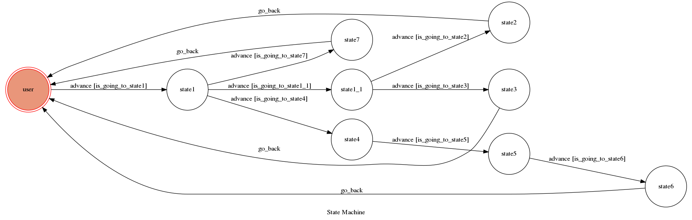

# TOC Project 2019

Template Code for TOC Project 2019

A Facebook messenger bot based on a finite state machine

## Setup

### Prerequisite
* Python 3
* Facebook Page and App
* ngrok HTTPS Server

#### Install Dependency
```sh
pip3 install -r requirements.txt
```

#### Run the sever

```sh
python3 app.py
```
```sh
./ngrok http 9990
```

## Finite State Machine


## Purpose
I want to built a chatbot with features that will come in  handy for students in NCKU.

## Usage
The initial state is set to `user`.

Enter anything to go to `state1`, which shows you three buttons of the service that this chatbot offers. 

The followings will show the detail of each service.

**1. Check course catalog**

If you click `check course catalog`, `state1` will be triggered to `advance` to `state1_1`.

In `state1_1`, you can either enter `all` to show all the department in NCKU, or just type in a specific one to get that department's course catalog.

After replying, chatbot will go back to state `user` and wait for another trigger.

**2. Calculate the distance to NCKU**

If you click `caculate the distance to NCKU`, `state1` will be triggered to `advance` to `state4`. 

In `state4`,  you'll be asked to type in `where do you want to go from`, and offers you eight options, which is eight campus in NCKU that you would like to go to, to choose on.

Chatbot will reply you the distance of two locations, also with the amount of time it will take by foot.

After replying, chatbot will go back to state `user` and wait for another trigger.

**3. View the map of NCKU**

If you click `view the map of NCKU`, `state1` will be triggered to `advance` to `state7`. 

Chatbot will reply you with a image of the map of NCKU.

After replying, chatbot will go back to state `user` and wait for another trigger.
